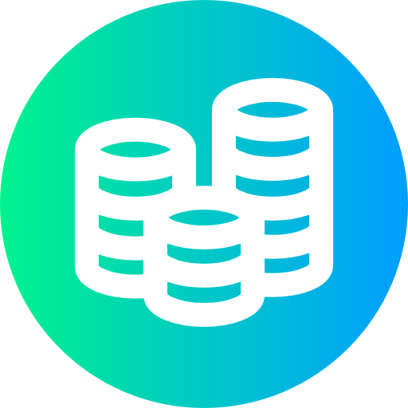

<a id="readme-top"></a>

<!-- PROJECT SHIELDS -->

[![Contributors][contributors-shield]][contributors-url]
[![Forks][forks-shield]][forks-url]
[![Stargazers][stars-shield]][stars-url]
[![Issues][issues-shield]][issues-url]
[![LinkedIn][linkedin-shield]][linkedin-url]

<!-- PROJECT LOGO -->
<br />
<div align="center">
  <a href="https://github.com/StereoPT/coin-guard">
    
  </a>

  <h3 align="center">CoinGuard</h3>

  <p align="center">
    Take control of your personal finances with comprehensive tracking and insights
    <br />
    <a href="https://github.com/StereoPT/coin-guard"><strong>Explore the docs »</strong></a>
    <br />
    <br />
    <a href="https://github.com/StereoPT/coin-guard">View Demo</a>
    ·
    <a href="https://github.com/StereoPT/coin-guard/issues/new?labels=bug">Report Bug</a>
    ·
    <a href="https://github.com/StereoPT/coin-guard/issues/new?labels=enhancement">Request Feature</a>
  </p>
</div>

<!-- TABLE OF CONTENTS -->
<details>
  <summary>Table of Contents</summary>
  <ol>
    <li>
      <a href="#about-the-project">About The Project</a>
      <ul>
        <li><a href="#built-with">Built With</a></li>
      </ul>
    </li>
    <li>
      <a href="#getting-started">Getting Started</a>
      <ul>
        <li><a href="#prerequisites">Prerequisites</a></li>
        <li><a href="#installation">Installation</a></li>
      </ul>
    </li>
    <li><a href="#usage">Usage</a></li>
    <li><a href="#roadmap">Roadmap</a></li>
    <li><a href="#contributing">Contributing</a></li>
    <li><a href="#license">License</a></li>
    <li><a href="#contact">Contact</a></li>
    <li><a href="#acknowledgments">Acknowledgments</a></li>

  </ol>
</details>

<!-- ABOUT THE PROJECT -->

## About The Project

[![CoinGuard Screen Shot][product-screenshot]](https://github.com/StereoPT/coin-guard)

CoinGuard is a comprehensive web application designed to help you take control of your personal finances. Whether you're looking to track your daily expenses, monitor your income streams, or set ambitious financial goals, CoinGuard provides you with the tools you need to make informed financial decisions.

Key features include:

- **Income & Expense Tracking** - Monitor all your financial transactions in one place
- **Savings Management** - Track your savings progress and set realistic targets
- **Financial Goal Setting** - Define and work towards your financial objectives
- **Comprehensive Reports** - Generate detailed insights about your financial health
- **User-friendly Interface** - Clean, intuitive design built with modern web technologies

CoinGuard empowers you to understand your spending patterns, identify areas for improvement, and build a stronger financial future. No more wondering where your money went – with CoinGuard, you're always in control.

<p align="right">(<a href="#readme-top">back to top</a>)</p>

### Built With

CoinGuard is built using modern web technologies to ensure a fast, reliable, and user-friendly experience.

- [![Next][Next.js]][Next-url]
- [![React][React.js]][React-url]
- [![TailwindCSS][TailwindCSS.com]][TailwindCSS-url]
- [![Prisma][Prisma.io]][Prisma-url]

<p align="right">(<a href="#readme-top">back to top</a>)</p>

<!-- GETTING STARTED -->

## Getting Started

To get a local copy of CoinGuard up and running, follow these simple steps.

### Prerequisites

Make sure you have the following installed on your system:

- Node.js (version 18 or higher)
- npm
  ```sh
  npm install npm@latest -g
  ```

### Installation

1. Clone the repository
   ```sh
   git clone https://github.com/StereoPT/coin-guard.git
   ```
2. Navigate to the project directory
   ```sh
   cd coin-guard
   ```
3. Install NPM packages
   ```sh
   npm install
   ```
4. Set up your database with Prisma
   ```sh
   npx prisma migrate dev
   npx prisma generate
   ```
5. Start the development server
   ```sh
   npm run dev
   ```
6. Open [http://localhost:3000](http://localhost:3000) in your browser to see the application

<p align="right">(<a href="#readme-top">back to top</a>)</p>

<!-- USAGE EXAMPLES -->

## Usage

CoinGuard makes personal finance management simple and intuitive:

### Track Your Finances

- Add or import your transactions from CGD
- Record expenses across different categories
  - You can create and manage categories
- Monitor your account over time

### Generate Reports

- View comprehensive financial reports
- Analyze spending patterns by category and time period

### Dashboard Overview

- Get a quick snapshot of your financial health
- See recent transactions at a glance
- Monitor key financial metrics

<p align="right">(<a href="#readme-top">back to top</a>)</p>

<!-- ROADMAP -->

## Roadmap

- [x] Basic income and expense tracking
- [x] Financial goal setting
- [x] Report generation
- [ ] Update dependencies
- [ ] Replace eslint + prettier with Biome
- [ ] Analytics Sections

See the [open issues](https://github.com/StereoPT/coin-guard/issues) for a full list of proposed features (and known issues).

<p align="right">(<a href="#readme-top">back to top</a>)</p>

<!-- CONTRIBUTING -->

## Contributing

Contributions are what make the open source community such an amazing place to learn, inspire, and create. Any contributions you make are **greatly appreciated**.

If you have a suggestion that would make CoinGuard better, please fork the repo and create a pull request. You can also simply open an issue with the tag "enhancement".
Don't forget to give the project a star! Thanks again!

1. Fork the Project
2. Create your Feature Branch (`git checkout -b feature/AmazingFeature`)
3. Commit your Changes (`git commit -m 'Add some AmazingFeature'`)
4. Push to the Branch (`git push origin feature/AmazingFeature`)
5. Open a Pull Request

### Top contributors:

<a href="https://github.com/StereoPT/coin-guard/graphs/contributors">
  
</a>

<p align="right">(<a href="#readme-top">back to top</a>)</p>

<!-- LICENSE -->

## License

Distributed under the MIT License. See `LICENSE.md` for more information.

<p align="right">(<a href="#readme-top">back to top</a>)</p>

<!-- CONTACT -->

## Contact

StereoPT - [@StereoPT](https://github.com/StereoPT) - stereopt@gmail.com

Project Link: [https://github.com/StereoPT/coin-guard](https://github.com/StereoPT/coin-guard)

<p align="right">(<a href="#readme-top">back to top</a>)</p>

<!-- ACKNOWLEDGMENTS -->

## Acknowledgments

Special thanks to the following resources and tools that made CoinGuard possible:

- [Next.js Documentation](https://nextjs.org/docs)
- [shadcn/ui Components](https://ui.shadcn.com)

<p align="right">(<a href="#readme-top">back to top</a>)</p>

<!-- MARKDOWN LINKS & IMAGES -->

[contributors-shield]: https://img.shields.io/github/contributors/StereoPT/coin-guard.svg?style=for-the-badge
[contributors-url]: https://github.com/StereoPT/coin-guard/graphs/contributors
[forks-shield]: https://img.shields.io/github/forks/StereoPT/coin-guard.svg?style=for-the-badge
[forks-url]: https://github.com/StereoPT/coin-guard/network/members
[stars-shield]: https://img.shields.io/github/stars/StereoPT/coin-guard.svg?style=for-the-badge
[stars-url]: https://github.com/StereoPT/coin-guard/stargazers
[issues-shield]: https://img.shields.io/github/issues/StereoPT/coin-guard.svg?style=for-the-badge
[issues-url]: https://github.com/StereoPT/coin-guard/issues
[linkedin-shield]: https://img.shields.io/badge/-LinkedIn-black.svg?style=for-the-badge&logo=linkedin&colorB=555
[linkedin-url]: https://linkedin.com/in/guidosp
[product-screenshot]: images/banner.png
[Next.js]: https://img.shields.io/badge/next.js-000000?style=for-the-badge&logo=nextdotjs&logoColor=white
[Next-url]: https://nextjs.org/
[React.js]: https://img.shields.io/badge/React-20232A?style=for-the-badge&logo=react&logoColor=61DAFB
[React-url]: https://reactjs.org/
[TailwindCSS.com]: https://img.shields.io/badge/Tailwind_CSS-38B2AC?style=for-the-badge&logo=tailwind-css&logoColor=white
[TailwindCSS-url]: https://tailwindcss.com/
[Prisma.io]: https://img.shields.io/badge/Prisma-3982CE?style=for-the-badge&logo=Prisma&logoColor=white
[Prisma-url]: https://prisma.io/
